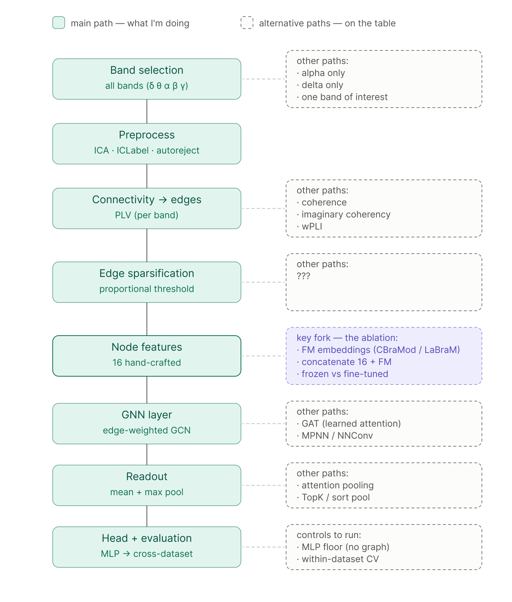

# ASD EEG Preprocessing Pipeline (OpenNeuro ds006780)

A reproducible EEG preprocessing pipeline for the **OpenNeuro ds006780** autism spectrum disorder (ASD) dataset. The project follows a modular, notebook-based workflow with reusable Python infrastructure for cloud storage, experiment tracking, and quality control.

The pipeline converts raw BIDS EEG recordings into artifact-cleaned MNE `.fif` files suitable for downstream analyses such as ERP, resting-state connectivity, or machine learning.

---

# Dataset

* **Dataset:** OpenNeuro `ds006780`
* **Population:** Autism Spectrum Disorder (ASD)
* **Input formats:** `.bdf`, `.edf`, `.vhdr`, `.set`
* **Tasks:** `Restingstate`, `FAST`, `IC`, `motor`
* **Scale:** 136 subjects (~2,171 recordings)

Raw recordings are streamed directly from the OpenNeuro S3 bucket. Intermediate derivatives and quality-control outputs can optionally be synchronized with Google Cloud Storage (GCS).

---

# Repository Layout

```text
ASD_EEG_PROJECT/
│
├── asd_eeg/                  # reusable Python package
│   ├── infra/
│   │   ├── gcs_io.py
│   │   └── wandb_tracking.py
│   ├── metrics/
│   ├── plotting/
│   └── utils/
│
├── notebooks/
│   ├── 00_data_understanding.ipynb
│   ├── 01_preprocessing_pre_ica_v2.ipynb
│   ├── 02_ica_fit_local_v2.ipynb
│   ├── 03_ica_apply.ipynb
│   ├── 04_epoching.ipynb
│   └── qc_ica_quality.ipynb
│
├── CLAUDE.md
├── README.md
└── pyproject.toml
```

---


---

# Planned pipline

> **Status: design only — not implemented in this repository.** Everything below sits
> downstream of `desc-epo.fif` and is recorded here to document the design space and the
> choices made within it. The repository currently ends at Stage 4 (epoching) + ICA QC.

The intended downstream analysis builds per-subject connectivity graphs from the epoched
data and classifies them with a graph neural network. The diagram shows the main path
(solid) alongside the alternatives considered at each decision point (dashed), with the
central ablation — hand-crafted vs. foundation-model node features — highlighted.



Two dependencies on the preprocessing stages are worth stating explicitly:

* **Band coverage is capped by Stage 1.** `TASK_CONFIG` lowpasses non-motor tasks at 40 Hz,
  so a γ band for `Restingstate` / `FAST` / `IC` would span only 30–40 Hz, against the filter
  rolloff. Full-γ analysis requires either restricting γ to `motor` or re-running Stage 1
  with a higher lowpass.
* **`autoreject` is not in the current pipeline.** Stage 3 performs ICA/ICLabel rejection
  only, and Stage 4 deliberately applies no epoch rejection (`GLOBAL_REJECT = None`).

---

# Notebooks

| Notebook                            | Purpose                                                     |
| ----------------------------------- | ----------------------------------------------------------- |
| `00_data_understanding.ipynb`       | Dataset exploration and sanity checks                       |
| `01_preprocessing_pre_ica_v2.ipynb` | Filtering, resampling, bad-channel detection, interpolation |
| `02_ica_fit_local_v2.ipynb`         | Average referencing and ICA decomposition                   |
| `03_ica_apply.ipynb`                | ICLabel-based artifact rejection and ICA application        |
| `04_epoching.ipynb`                 | Per-task epoching (fixed-length / event-related) → `desc-epo.fif` |
| `qc_ica_quality.ipynb`              | Quantitative and visual ICA quality control                 |

---

# Infrastructure

The reusable Python package (`asd_eeg`) provides the shared infrastructure used by every notebook.

## GCS

All Google Cloud Storage operations go through:

```python
from asd_eeg import gcs_io
```

The notebooks never instantiate their own GCS clients.

`GCSStore` handles:

* discovery
* downloads
* uploads
* caching
* retry logic
* file pairing

---

## Experiment Tracking

All experiment tracking is centralized in:

```python
from asd_eeg import wandb_tracking as wbt
```

The helper provides:

* run initialization
* metric logging
* artifact logging
* summary generation
* offline/no-op execution

All preprocessing stages and the ICA QC workflow use the same tracking interface.

---

# Output Structure

All derivatives are written under:

```text
~/asd_eeg_pipeline/
```

Typical layout:

```text
derivatives/
├── mne-preproc-pre-ica/
├── mne-ica-fit/
├── mne-ica-apply/
├── mne-epochs/
├── qc-ica/
└── logs/
```

---

# Installation

```bash
pip install -e .
```

Install the runtime dependencies:

```bash
pip install mne \
            mne-bids \
            mne-icalabel \
            pandas \
            numpy \
            joblib \
            tqdm \
            python-picard \
            boto3 \
            google-cloud-storage \
            pyprep \
            onnxruntime \
            wandb
```

Optional (for GCS support):

```bash
gcloud auth application-default login
```

---

# Running the Pipeline

Run the notebooks in order:

1. `01_preprocessing_pre_ica_v2.ipynb`
2. `02_ica_fit_local_v2.ipynb`
3. `03_ica_apply.ipynb`
4. `04_epoching.ipynb`
5. `qc_ica_quality.ipynb`

Run each notebook's smoke-test section on a single recording before processing the full dataset.

---

# Main Technologies

* MNE-Python
* MNE-BIDS
* MNE-ICALabel
* PyPREP
* Picard ICA
* Google Cloud Storage
* Weights & Biases
* OpenNeuro S3

---

# License

Specify the project license here.
